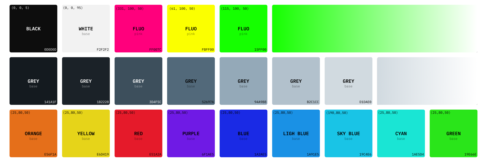

# 🌊 Flow

 

Flow is an [Nvim](https://github.com/neovim/neovim) color scheme designed for transparent or dark backgrounds. It features
carefully designed colors to help focusing during coding plus fluorescent details to provide a vibrant environment. Why fluo? Because it is
cool!

## Showcase

 


## Palette

Flow has been designed to use a palette based on 9 colors selected on the HSL representation. The principal color is the light blue, and the
other colors has been chosen in the following way:

- **Analogous** (S+/-30): blue, cyan.
- **Complementary** (S+/-180): orange.
- **Tetradic** 60 (S+/-60): purple, green.
- **Slit comp** (S+/-150): yellow, red.

To these colors it has been added the teal to provide a more bluish palette and the fluo one. The palette is defined with 3 different level of light:

|Bright|Normal|Dim|
|-|-|-|
|L=80|L=70|L=30|

 


## Requirements

- [Neovim](https://github.com/neovim/neovim) >=
  [0.8.0](https://github.com/neovim/neovim/releases/tag/v0.8.0)

## Installation

Install the theme with your preferred package manager, such as
[folke/lazy.nvim](https://github.com/folke/lazy.nvim):

```lua
{
  "0xstepit/flow.nvim",
  lazy = false,
  priority = 1000,
  opts = {},
}
```

## Usage

### [Lua](https://www.lua.org)

```lua
require("flow").setup {}
vim.cmd "colorscheme flow"
```

## Configuration

> ❗️ Set the configuration **BEFORE** loading the color scheme with `colorscheme flow`.

### Example configuration

```lua 
return {
  "0xstepit/flow.nvim",
  name = "Flow",
  lazy = false,
  priority = 1000,
  opts = {},
  config = function()
    require("flow").setup {
      transparent = true,
      brighter = true,
      fluo_color = "yellow"
    }

    vim.cmd "colorscheme flow"
  end,
}
```
## Supported plugins

Below the list of supported plugins divided by category:.

- **Git**: [fugitive](https://github.com/tpope/vim-fugitive), [gitsign](https://github.com/lewis6991/gitsigns.nvim).
- **Completion**: [nvim-cmp](https://github.com/hrsh7th/nvim-cmp), [lsp-kind](https://github.com/onsails/lspkind.nvim).
- **Debug**: [nvim-dap](https://github.com/mfussenegger/nvim-dap).
- **Plugins**: [lazy](https://github.com/folke/lazy.nvim).
- **Coding**: [telescope](https://github.com/nvim-telescope/telescope.nvim), [treesitter](https://github.com/nvim-treesitter/nvim-treesitter).
- **Utils**: [trouble](https://github.com/folke/trouble.nvim), [todo-comments](https://github.com/folke/todo-comments.nvim), [which-key](https://github.com/folke/which-key.nvim).
- **Base Nvim**: diagnostic, lsp, markdown.

## Todo

This is still an ongoing project. Below are the next topics I will work on:

- [ ] Fix extra automatic generation.

## Contributing

Pull requests are welcome.

## References

This colorscheme is inspired by the amazing [Tokyo Night](https://github.com/folke/tokyonight.nvim) plugin.

