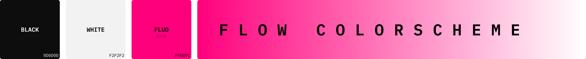

# 🌊 Flow

 

Flow is an [Nvim](https://github.com/neovim/neovim) color scheme written in
[Lua](https://www.lua.org/). It features carefully designed colors to help
focusing during coding plus fluorescent details to provide a vibrant environment.
Why fluo? Because it's cool!

## Showcase


# Palette

Flow has been designed using a palette based on 9 colors selected through the HSL representation to
create a cohesive ambiance. The principal color is the light blue, and the additional colors have been chosen
as follows:

- **Analogous** (S+/-30): blue, cyan.

- **Complementary** (S+/-180): orange.

- **Tetradic** 60 (S+/-60): purple, green.

- **Split comp** (S+/-150): yellow, red.

Furthermore, sky blue has been included to enhance the blue tones, and a fluorescent color has been added for
striking accents. 


The palette is defined across four different levels of light and saturation of
base color to provide different choices of based on the user preferences:

|               |Base|Bright|Dark|Desaturate|
|---------------|----|------|----|----------|
|**Light**      |X   |75    |25  |X         |
|**Saturation** |80  |80    |50  |50        |

Where X is equal to 70 if the dark theme is selected, or 30 if it is light. Flow allows a lot of
customizability in terms of background, main colors, and fluo, but from a big design space come 
big responsibilities! It is up to you to create a good atmosphere and an harmonic environment. In
the short future, I will create pre-defined configurations, but for the moment please, just try to
follow these guidelines:

- When you set a transparent background, use a dark desktop image with the dark theme and a light one
with the light theme.

- Do not use the dark mode with the dark theme, and, consequently, don't use bright mode with the
light theme.

# Requirements

- [Neovim](https://github.com/neovim/neovim) >=
  [0.8.0](https://github.com/neovim/neovim/releases/tag/v0.8.0)

## Installation

Install the theme with your preferred package manager, such as
[folke/lazy.nvim](https://github.com/folke/lazy.nvim):

```lua
{
  "0xstepit/flow.nvim",
  lazy = false,
  priority = 1000,
  opts = {},
}
```

# Usage

## Lua

```lua
require("flow").setup{}
vim.cmd "colorscheme flow"
```

# Configuration

## Default

The configuration allows to specify 5 different options:

```lua 
return {
  "0xstepit/flow.nvim",
  lazy = false,
  priority = 1000,
  opts = {},
  config = function()
    require("flow").setup{
      dark_theme = true, -- Set the theme with dark background.
      high_contrast = false, -- Make the dark background darker or the light background lighter.
      transparent = false, -- Set transparent background.
      fluo_color = "pink", -- Color used as fluo. Available values are pink, yellow, orange, or green.
      mode = "base", -- Mode of the colors. Available values are: dark, bright, desaturate, or base.
      aggressive_spell = false, -- Use colors for spell check.
    }

    vim.cmd "colorscheme flow"
  end,
}
```

## Suggested

<details>
<summary>My favorite config</summary>

```lua
return {
  "0xstepit/flow.nvim",
  lazy = false,
  priority = 1000,
  opts = {},
  config = function()
    require("flow").setup{
      dark_theme = true,
      transparent = false,
      high_contrast = false,
      fluo_color = "pink",
      mode = "desaturate",
      aggressive_spell = false,
    }
    vim.cmd "colorscheme flow"
  end,
}
```
</details>


# Supported plugins

Below the list of supported plugins divided by category:

- **Git**: [fugitive](https://github.com/tpope/vim-fugitive), [gitsign](https://github.com/lewis6991/gitsigns.nvim).

- **Completion**: [nvim-cmp](https://github.com/hrsh7th/nvim-cmp), [lsp-kind](https://github.com/onsails/lspkind.nvim).

- **Debug**: [nvim-dap](https://github.com/mfussenegger/nvim-dap).

- **Plugins**: [lazy](https://github.com/folke/lazy.nvim).

- **Coding**: [telescope](https://github.com/nvim-telescope/telescope.nvim), [treesitter](https://github.com/nvim-treesitter/nvim-treesitter).

- **Utils**: [trouble](https://github.com/folke/trouble.nvim), [todo-comments](https://github.com/folke/todo-comments.nvim), [which-key](https://github.com/folke/which-key.nvim).

- **Base Nvim**: diagnostic, lsp, markdown.

# Extras

Flow.nvim provides colorschemes also for the following tools:

- [Tmux](https://github.com/tmux/tmux/wiki) at [tmux-flow.conf](./extra/tmux-flow.conf).

- [Alacritty](https://alacritty.org/) at [alacritty-flow.toml](./extra/alacritty-flow.toml).

- [fzf](https://github.com/junegunn/fzf) at [fzf-flow.sh](./extra/fzf-flow.sh).

The generation of extra is not automatic (I'm sorry, I'm working on it). If you want
to generate the color scheme for extras, you need to perform the following steps:

1. Change the config used for the extra theme generation in `lua/flow/extra/main.lua` without
setting the background transparent.

2. Generate the themes:

```sh
cd ./lua/flow/extra
lua main.lua -v
```

Now you copy the files in where your configuration is sourcing them.

# Todo

This is still an ongoing project. Below are the next topics I will work on:

- [ ] Add docs.

- [ ] Extra automatic generation.

- [ ] Create predefined configurations of the theme.

If you want to contribute to this project, please consider addressing one of the
previous point :)

# Contributing

Pull requests and improvement suggestions are very welcome!

# References

My dot config [0xstepit/dotfiles](https://github.com/0xstepit/dotfiles).

This colorscheme is inspired by other amazing colorscheme:

- [Tokyo Night](https://github.com/folke/tokyonight.nvim)

- [Gruvbox](https://github.com/morhetz/gruvbox)

- [Nordic](https://github.com/AlexvZyl/nordic.nvim)
