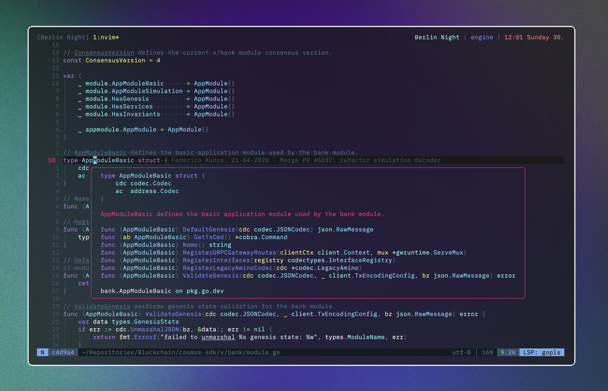

# Berlin Night

Berlin Night is an [Nvim](https://github.com/neovim/neovim) color scheme designed for transparent or dark backgrounds.
It features a retro aesthetic with a distinct emphasis on greys, characteristic of Berlin's unique ambiance.

 

## Supported plugins

- Supports the latest [Neovim](https://github.com/neovim/neovim)
  [0.9.0](https://github.com/neovim/neovim/releases/tag/v0.9.0) features.
- Enhances terminal colors.
- Introduces a darker background option for sidebar-like windows.
- Supports all major plugins.
- Provides [Berlin Night](https://github.com/0xstepit/berlin-night.nvim) extras for numerous other applications.

### Extras

Berlin Night provides extra colorschemes with the same aesthetic to be used in the 
following software:

<!-- extras:start -->
- [Alacritty](https://github.com/alacritty/alacritty) ([alacritty](extras/alacritty))
- [Fzf](https://github.com/junegunn/fzf) ([fzf](extras/fzf))
- [Lua Table for testing](https://www.lua.org) ([lua](extras/lua))
- [Tmux](https://github.com/tmux/tmux/wiki) ([tmux](extras/tmux))
<!-- extras:end -->

## Requirements

- [Neovim](https://github.com/neovim/neovim) >=
  [0.8.0](https://github.com/neovim/neovim/releases/tag/v0.8.0)

## Installation

Install the theme with your preferred package manager, such as
[folke/lazy.nvim](https://github.com/folke/lazy.nvim):

```lua
{
  "0xstepit/berlin-night.nvim",
  lazy = false,
  priority = 1000,
  opts = {},
}
```

## Usage

### [Lua](https://www.lua.org)

```lua
    vim.cmd "colorscheme flow"
```

#### External plugins

##### [Lualine](https://github.com/nvim-lualine/lualine.nvim)

```lua
-- Lua
require('lualine').setup {
  options = {
    -- ... your lualine config
    theme = 'flow'
    -- ... your lualine config
  }
}
```

## Configuration

> ❗️ Set the configuration **BEFORE** loading the color scheme with `colorscheme flow`.

### Example configuration

```lua 
return {
  "0xstepit/berlin-night.nvim",
  dev = true,
  -- name = "Berlin Night",
  lazy = false,
  priority = 1000,
  opts = {},
  config = function()
    require("flow").setup {
      transparent = true,
      styles = {
        sidebars = "transparent",
        floats = "transparent",
      },
    }
    vim.cmd "colorscheme flow"
  end,
}
```
## Contributing

Pull requests are welcome.

For the [extras](#-extras), we use a simple template system that can be used to
generate themes for the different styles.

How to add a new extra template:

1. Create a file like `lua/flow/extra/cool-app.lua`.
2. Add the name and output file extension to the `extras` table in
   `lua/flow/extra/init.lua`.
3. Run the following command to generate new [extra](#-extras) themes from the flow plugin directory:

   ```sh
   nvim --headless "+lua require('flow.extra').setup()" +qa
   ```

4. Check the newly created themes in the `extra/` directory. Please **DO NOT**
   commit them, as they are already automatically built by the CI.

## References

This colorscheme is inspired by the amazing [Tokyo Night](https://github.com/folke/tokyonight.nvim) plugin.

## Disclaimer

This project is still a WIP so minor bug can be found. In that case, please, add an issue!
